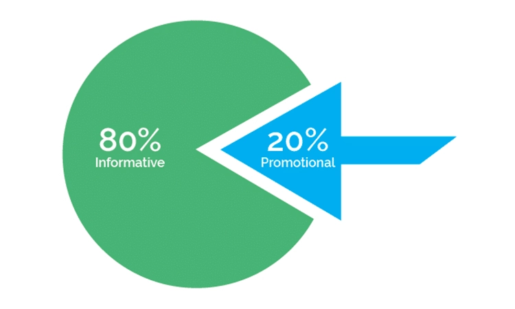
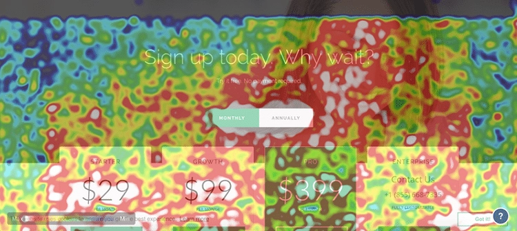
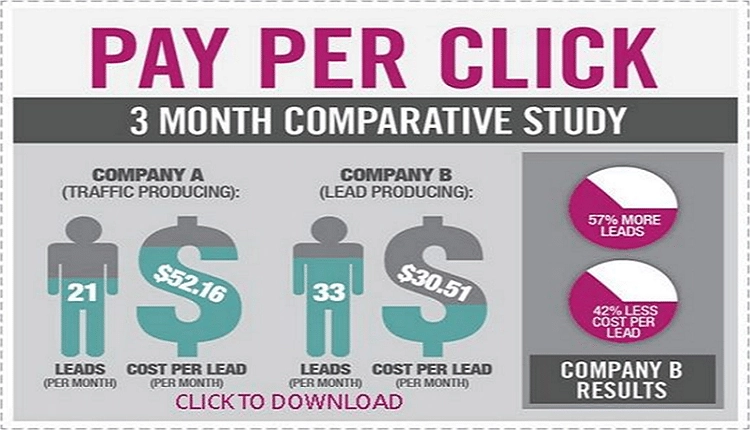
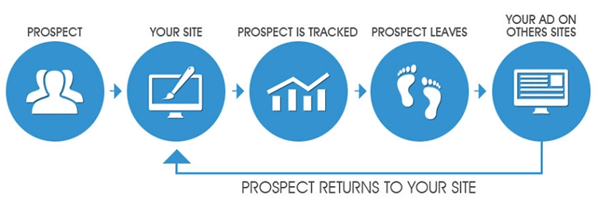

# Transform Your E-commerce Business: 8 Proven Marketing Strategies That Actually Work

You've got your e-commerce store up and running—now what? Here's the thing: having a website isn't enough anymore. You need real strategies that bring actual customers through your digital doors. This guide breaks down eight practical marketing approaches that can genuinely move the needle on your sales, from content that connects to smart retargeting that brings shoppers back. Whether you're just starting out or looking to level up your existing game, these tactics will help you cut through the noise and reach the people who actually want what you're selling.

---

## Content Quality: Your Secret Weapon

Let's be honest—nobody wants to read boring product descriptions anymore. Your content needs to do more than just exist; it needs to pull people in and make them care.

Think about it this way: when you create genuinely useful, interesting content, you're not just filling up web pages. You're starting conversations. You're answering questions your customers haven't even asked yet. That blog post about "how to style winter boots three different ways" isn't just filler—it's the thing that makes someone think, "Oh, these people get it. They understand what I'm trying to do."

Good content creates connection. And connection? That's what turns browsers into buyers.

## Work On Website Layout: Make It Stupid Simple

Here's a truth bomb: if your website confuses people, they leave. It's that simple.

Your site needs to be so intuitive that your grandmother could navigate it after three glasses of wine. Clean layout, clear buttons, obvious next steps. No treasure hunts for the checkout button. No mystery meat navigation that makes people guess where things are.

Heat maps are your friend here—they show you exactly where people click, where they get stuck, and where they bail. Use that data. If 80% of visitors never scroll past your hero image, maybe your most important stuff shouldn't be buried at the bottom of the page.

## Social Media Marketing: Meet Your Customers Where They Live

You know where your customers are right now? Scrolling through Instagram. Watching TikToks. Checking their Twitter feed for the fifteenth time today.

Social media isn't optional anymore—it's where the conversation happens. And if you're not part of that conversation, someone else is. 👉 [Discover how leading brands track competitor social strategies and customer sentiment to stay ahead](https://www.scraperapi.com/?fp_ref=coupons)

But here's the catch: you can't just blast promotional posts into the void and call it a day. Social media works when you're actually social. Respond to comments. Share user-generated content. Show the humans behind your brand. People don't follow companies—they follow personalities.

## Email Marketing: The Unglamorous Workhorse

Email marketing isn't sexy. It's not the hot new platform everyone's talking about. But you know what? It works.

Think about your own inbox. Sure, you get spam. But you also get emails from brands you actually like—the ones announcing new products you're genuinely interested in, or offering deals that feel personally relevant.

That's what good email marketing does. It keeps you on your customers' radar without being annoying. A weekly newsletter. A heads-up about new arrivals. An exclusive discount for loyal subscribers. These aren't interruptions—they're invitations.

## Search Engine Optimization: Get Found or Get Lost

Let's cut to the chase: if you're not on the first page of Google, you basically don't exist.

SEO isn't some dark art—it's about making sure search engines understand what you offer and who needs it. Good UX, relevant content, proper keywords naturally woven in (not stuffed like a Thanksgiving turkey). It's also about understanding what your competitors are doing right.

Watch what keywords they rank for. See what content performs well for them. Learn from businesses that are already winning in your space. This competitive intelligence isn't cheating—it's smart business.

## Pay-Per-Click Marketing: When You Need Results Yesterday

PPC is instant gratification for marketers. You set up an ad, target the right people, and boom—traffic.

But here's where most people mess up: they think the ad is the whole game. Wrong. You need three things working together: a compelling ad, an irresistible offer, and a landing page that delivers on both promises. If any of those three sucks, your money's going down the drain.

The beautiful thing about PPC? You can test and tweak in real-time. That headline not working? Change it. Wrong audience? Adjust your targeting. It's like having a laboratory for figuring out what makes your customers tick.

## Go For Mobile App Development: Because Everyone's On Their Phone

Quick question: when's the last time you opened your laptop just to check something online? Probably been a while, right?

Your customers are the same. They're browsing your store during their lunch break, on the train, while pretending to watch TV with their family. If your site looks janky on mobile, they're gone before you can say "responsive design."

Mobile-first isn't a buzzword—it's survival. And geo-targeting through mobile? That's the cherry on top. Imagine sending a special offer to someone's phone when they're literally walking past your competitor's store. That's the kind of power mobile gives you.

## Retargeting: The Gentle Nudge That Converts

Here's something that'll blow your mind: most people who visit your site aren't going to buy. Not today, anyway.

That's where retargeting comes in. Someone looked at those sneakers but didn't pull the trigger? Show them those same sneakers in their Facebook feed tomorrow. Maybe throw in a 10% discount code while you're at it.

Retargeting isn't creepy stalking—it's smart reminding. You're not annoying people; you're staying visible to folks who already showed interest. They've already raised their hand and said, "I'm curious." You're just making sure they don't forget about you.

---

## The Bottom Line

Growing an e-commerce business isn't about finding one magic trick—it's about combining multiple strategies that work together. Content that engages, a site that converts, social presence that builds community, emails that add value, SEO that gets you found, PPC that delivers quick wins, mobile optimization that meets people where they are, and retargeting that brings them back.

None of these strategies exist in isolation. The content you create feeds your SEO. Your social media drives email signups. Your PPC campaigns inform your organic strategy. It's all connected, all working together to build something bigger than any single tactic could achieve alone. And when you need reliable data to understand what's working across all these channels, 👉 [smart businesses rely on tools that help them track performance and competitor strategies without getting blocked](https://www.scraperapi.com/?fp_ref=coupons).
